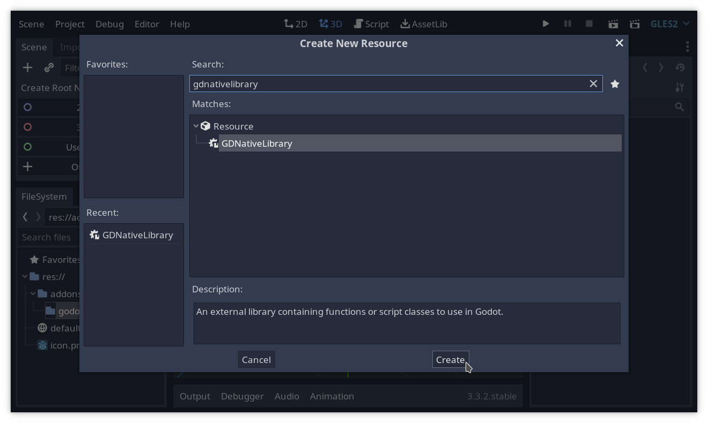
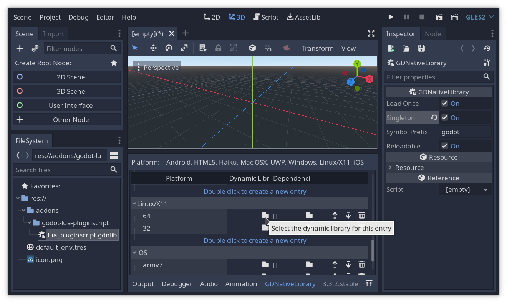

# Implementing the skeleton of a GDNative + PluginScript library
2021-08-03 | `#Godot #Lua #LuaJIT #GDNative #PluginScript #C` | [*Versão em Português*](2-infrastructure-pt.md)

In the [last post we talked about the design of a plugin for using Lua as a scripting language in Godot](1-design-en.md).
Today we'll start implementing our plugin with the barebones
infrastructure: a [GDNative](https://godotengine.org/article/look-gdnative-architecture)
library that registers [Lua](https://www.lua.org/) as a scripting
language for the [Godot game engine](https://godotengine.org/).
The scripting runtime won't work for now, but Godot will correctly load
our library and import `.lua` files.


## How to GDNative
Let's start building an empty GDNative library.
These are shared libraries (DLLs) that are loaded at runtime by the
engine.
They must declare and export the functions `godot_gdnative_init` and
`godot_gdnative_terminate`, to be called when the module is initialized
and terminated, respectively.

GDNative libraries are loaded only when needed by the project, unless
they are marked as [singletons](https://docs.godotengine.org/en/stable/classes/class_gdnativelibrary.html#class-gdnativelibrary-property-singleton).
Since we want ours to be loaded at project startup, so that Lua scripts
can be imported, we'll make it a singleton.
For this, we also need to declare a function called
`godot_gdnative_singleton`, or Godot won't load our library.
The downside of using singleton GDNative libraries is that they are
never reloaded, so we'll have to reopen the editor each time we
recompile it.

Ok, time to start this up!
First of all, let's download the [GDNative C API repository](https://github.com/godotengine/godot-headers.git lib/godot-headers).
Since I'm using [Git](https://git-scm.com/) for the project, I'll add it
as a submodule.
I'm using the `lib` directory for maintaining all third-party libraries
at the same place.

```sh
git submodule add https://github.com/godotengine/godot-headers.git lib/godot-headers
```

The GDNative API is very low-level, so I'll also be using my own
[High Level GDNative C/C++ API (HGDN)](https://github.com/gilzoide/high-level-gdnative):

```sh
git submodule add https://github.com/gilzoide/high-level-gdnative.git lib/high-level-gdnative
```

We'll be storing our source files in the `src` folder, for organization.
Here is the skeleton for our GDNative module source, in C:

```c
// src/language_gdnative.c

// HGDN already includes godot-headers
#include "hgdn.h"

// GDN_EXPORT makes sure our symbols are exported in the way Godot expects
// This is not needed, since symbols are exported by default, but it
// doesn't hurt being explicit about it
GDN_EXPORT void godot_gdnative_init(godot_gdnative_init_options *options) {
    hgdn_gdnative_init(options);
}

GDN_EXPORT void godot_gdnative_terminate(godot_gdnative_terminate_options *options) {
    hgdn_gdnative_terminate(options);
}

GDN_EXPORT void godot_gdnative_singleton() {
}
```

Since HGDN is a header-only library, we need a C or C++ file for the
implementation. We could use `src/language_gdnative.c` for this, but
I'll add a new file for it to avoid recompiling HGDN implementation on
future builds:

```c
// src/hgdn.c
#define HGDN_IMPLEMENTATION
#include "hgdn.h"
```

Time to build!
I'll be using [xmake](https://xmake.io) as build system, because it
is simple to use and supports several platforms, as well as
cross-compiling, out of the box.
Also, it has a nice package system integrated that we'll use for
embedding Lua/LuaJIT later.
The `xmake.lua` build script is as follows:

```lua
-- xmake.lua
target("lua_pluginscript")
    set_kind("shared")
    -- Set the output name to something easy to find like `build/lua_pluginscript_linux_x86_64.so`
    set_targetdir("$(buildir)")
    set_prefixname("")
    set_suffixname("_$(os)_$(arch)")
    -- Add "-I" flags for locating HGDN and godot-header files
    add_includedirs("lib/godot-headers", "lib/high-level-gdnative")
    -- src/hgdn.c, src/language_gdnative.c
    add_files("src/*.c")
target_end()
```

Run `xmake` and, if all goes well, we should have a `.so` or `.dll` or
`.dylib` shared library in the `build` folder.

Time to open Godot.
I've created a new project and added our module repository at
`addons/godot-lua-pluginscript`.
To make the FileSystem dock cleaner, I also [added .gdignore files](https://docs.godotengine.org/en/stable/getting_started/workflow/project_setup/project_organization.html#ignoring-specific-folders)
in the `build`, `lib` and `src` folders.
Now we need to create a new GDNativeLibrary Resource:





Set it as singleton:


And set the path to the shared library we just built:




Restart the editor and our module should be imported, nice!


# How to PluginScript
If we look at the [PluginScript API](https://github.com/godotengine/godot-headers/blob/3.3/pluginscript/godot_pluginscript.h#L166),
there is only one function defined, responsible for registering
scripting languages based on a description.
This description has information about the language name, file
extensions, information used for syntax highlighting in the code editor
such as reserved words, comment delimiters and string delimiters, as
well as several callbacks that Godot will call, e.g.: for
initializing/finalizing our language runtime, scripts and instances,
debugging and profiling code.

All we have to do is create the required callbacks, fill in this
description and register Lua as a scripting language!
For now we'll just add stubs for the plugin to be loaded, in the next
post we'll start implementing these callbacks.

First, let's implement stubs for the callbacks. We'll skip the optional
ones for now. Add the following in `src/language_gdnative.c`, just below
the initial `#include "hgdn.h"`:

```c
// Called when our language runtime will be initialized
godot_pluginscript_language_data *lps_language_init() {
    // TODO
    return NULL;
}

// Called when our language runtime will be terminated
void lps_language_finish(godot_pluginscript_language_data *data) {
    // TODO
}

// Called when Godot registers globals in the language, such as Autoload nodes
void lps_language_add_global_constant(godot_pluginscript_language_data *data, const godot_string *name, const godot_variant *value) {
    // TODO
}

// Called when a Lua script is loaded, e.g.: const SomeScript = preload("res://some_script.lua")
godot_pluginscript_script_manifest lps_script_init(godot_pluginscript_language_data *data, const godot_string *path, const godot_string *source, godot_error *error) {
    godot_pluginscript_script_manifest manifest = {};
    // All Godot objects must be initialized, or else our plugin SEGFAULTs
    hgdn_core_api->godot_string_name_new_data(&manifest.name, "");
    hgdn_core_api->godot_string_name_new_data(&manifest.base, "");
    hgdn_core_api->godot_dictionary_new(&manifest.member_lines);
    hgdn_core_api->godot_array_new(&manifest.methods);
    hgdn_core_api->godot_array_new(&manifest.signals);
    hgdn_core_api->godot_array_new(&manifest.properties);
    // TODO
    return manifest;
}

// Called when a Lua script is unloaded
void lps_script_finish(godot_pluginscript_script_data *data) {
    // TODO
}

// Called when a Script Instance is being created, e.g.: var instance = SomeScript.new()
godot_pluginscript_instance_data *lps_instance_init(godot_pluginscript_script_data *data, godot_object *owner) {
    // TODO
    return NULL;
}

// Called when a Script Instance is being finalized
void lps_instance_finish(godot_pluginscript_instance_data *data) {
    // TODO
}

// Called when setting a property on an instance, e.g.: instance.prop = value
godot_bool lps_instance_set_prop(godot_pluginscript_instance_data *data, const godot_string *name, const godot_variant *value) {
    // TODO
    return false;
}

// Called when getting a property from instance, e.g.: var value = instance.prop
godot_bool lps_instance_get_prop(godot_pluginscript_instance_data *data, const godot_string *name, godot_variant *ret) {
    // TODO
    return false;
}

// Called when calling a method on an instance, e.g.: instance.method(args)
godot_variant lps_instance_call_method(godot_pluginscript_instance_data *data, const godot_string_name *method, const godot_variant **args, int argcount, godot_variant_call_error *error) {
    // TODO
    return hgdn_new_nil_variant();
}

// Called when a notification is sent to instance
void lps_instance_notification(godot_pluginscript_instance_data *data, int notification) {
    // TODO
}
```

Right below, let's define our language description:

```c
// Declared as a global variable, because Godot needs the
// memory to be valid until our plugin is unloaded 
godot_pluginscript_language_desc lps_language_desc = {
    .name = "Lua",
    .type = "Lua",
    .extension = "lua",
    .recognized_extensions = (const char *[]){ "lua", NULL },
    .reserved_words = (const char *[]){
        // Lua keywords
        "and", "break", "do", "else", "elseif", "end",
        "false", "for", "function", "goto", "if", "in",
        "local", "nil", "not", "or", "repeat", "return",
        "then", "true", "until", "while",
        // Other important identifiers
        "self", "_G", "_ENV", "_VERSION",
        NULL
    },
    .comment_delimiters = (const char *[]){ "--", "--[[ ]]", NULL },
    .string_delimiters = (const char *[]){ "' '", "\" \"", "[[ ]]", "[=[ ]=]", NULL },
    // Lua scripts don't care about the class name
    .has_named_classes = false,
    // Builtin scripts didn't work for me, so disable for now...
    .supports_builtin_mode = false,

    // Callbacks
    .init = &lps_language_init,
    .finish = &lps_language_finish,
    .add_global_constant = &lps_language_add_global_constant,
    .script_desc = {
        .init = &lps_script_init,
        .finish = &lps_script_finish,
        .instance_desc = {
            .init = &lps_instance_init,
            .finish = &lps_instance_finish,
            .set_prop = &lps_instance_set_prop,
            .get_prop = &lps_instance_get_prop,
            .call_method = &lps_instance_call_method,
            .notification = &lps_instance_notification,
        },
    },
};
```

Now the final touch, change `godot_gdnative_init` to register the language:

```c
GDN_EXPORT void godot_gdnative_init(godot_gdnative_init_options *options) {
    hgdn_gdnative_init(options);
    hgdn_pluginscript_api->godot_pluginscript_register_language(&lps_language_desc);
}
```

Recompile the project by running the `xmake` command and reopen Godot.
Look at that, our `xmake.lua` file is being recognized as a Lua script
and syntax highlighting works! Awesome! =D


## Wrapping up
With the base of our PluginScript ready, we can now focus on actually
implementing the functionality.
The version of the project built in this article is available [here](https://github.com/gilzoide/godot-lua-pluginscript/tree/blog-2-infrastructure).

In the next post we'll link the project with LuaJIT and start
implementing the plugin callbacks.
I'll be using some Lua/C API and LuaJIT's FFI for this, so it will be a
very interesting adventure!

Until next time! ;]
