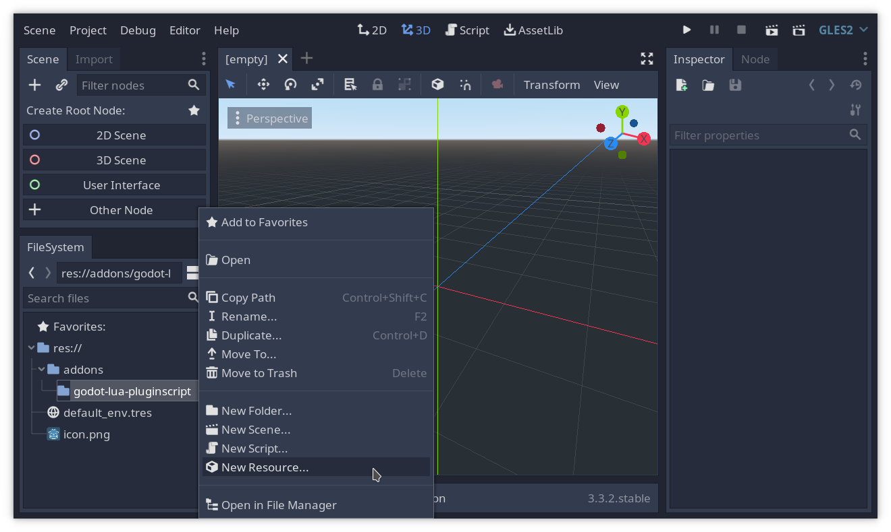
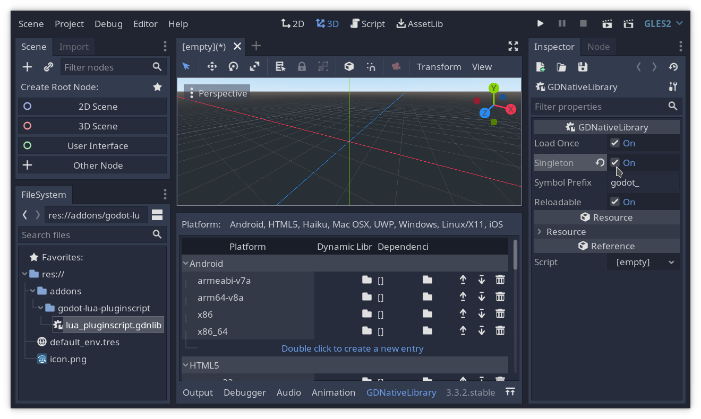
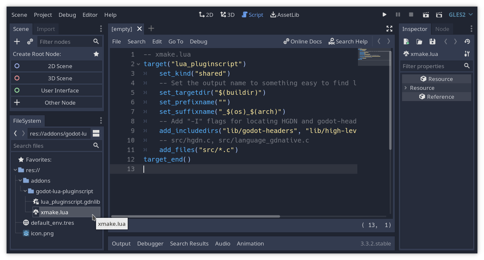

# Implementando o esqueleto de uma biblioteca GDNative + PluginScript
2021-08-04 | `#Godot #Lua #LuaJIT #GDNative #PluginScript #C` | [*English Version*](2-infrastructure-en.md)

No [artigo anterior, discutimos sobre o projeto de um *plugin* para usar
Lua no motor de jogos Godot](1-design-pt.md).
Hoje começaremos a implementar esse *plugin* com a infraestrutura base:
uma biblioteca [GDNative](https://godotengine.org/article/look-gdnative-architecture)
que registra [Lua](https://www.lua.org/portugues.html) como uma
linguagem de *scripting* em [Godot](https://godotengine.org/).
Os *scripts* ainda não funcionarão, mas Godot carregará corretamente
nosso *plugin* e reconhecerá arquivos `.lua`.


## Como usar GDNative
Vamos começar construindo uma biblioteca GDNative vazia.
Elas são bibliotecas dinâmicas (DLLs) que são carregadas em tempo
de execução pelo motor.
Elas devem declarar e exportar as funções `godot_gdnative_init` e
`godot_gdnative_terminate`, que serão chamadas quando o *plugin* é
carregado e finalizado, respectivamente.

Bibliotecas GDNative só são carregadas quando necessárias para o
projeto, a não ser que sejam marcadas como [*singletons*](https://docs.godotengine.org/pt_BR/stable/classes/class_gdnativelibrary.html#class-gdnativelibrary-property-singleton).
Como queremos que nosso *plugin* seja carregado ao inicializar o
projeto, para que *scripts* Lua sejam importados, marcaremos nossa
biblioteca como *singleton*.
Para isso, também precisamos declarar a função
`godot_gdnative_singleton`, ou Godot não aceitará nossa biblioteca.
O contra de usar uma biblioteca *singleton* é que precisaremos reiniciar
o editor toda vez que recompilarmos nosso *plugin*.

Beleza, hora de por a mão na massa! <br/>
Primeiramente, vamos baixar o [repositório da API em C do GDNative](https://github.com/godotengine/godot-headers).
Como estou usando [Git](https://git-scm.com/) para o projeto,
adicionarei o repositório como um [submódulo](https://git-scm.com/book/pt-br/v2/Git-Tools-Submodules).
Vamos usar a pasta `lib` pra manter todas as bibliotecas de terceiros
organizados.

```sh
git submodule add https://github.com/godotengine/godot-headers.git lib/godot-headers
```

Como a API GDNative é bem baixo-nível, vou adicionar minha própria
[API de alto nível para GDNative (HGDN)](https://github.com/gilzoide/high-level-gdnative)
pra facilitar a implementação:

```sh
git submodule add https://github.com/gilzoide/high-level-gdnative.git lib/high-level-gdnative
```

Vamos usar a pasta `src` para organizar nosso código-fonte.
Este é o esqueleto para uma biblioteca GDNative, em C:

```c
// src/language_gdnative.c

// HGDN já inclui godot-headers
#include "hgdn.h"

// GDN_EXPORT assegura que os símbolos são exportados do jeito que Godot
// espera. Isso não é necessário, já que os símbolos são exportados por
// padrão, mas custa nada deixar explícito
GDN_EXPORT void godot_gdnative_init(godot_gdnative_init_options *options) {
    hgdn_gdnative_init(options);
}

GDN_EXPORT void godot_gdnative_terminate(godot_gdnative_terminate_options *options) {
    hgdn_gdnative_terminate(options);
}

GDN_EXPORT void godot_gdnative_singleton() {
}
```

Como HGDN é uma biblioteca composta por somente um arquivo de cabeçalho,
precisamos de um arquivo C ou C++ para compilar sua implementação.
Poderíamos usar `src/language_gdnative.c` pra isso, mas vou adicionar um
arquivo novo pra evitar recompilar a implementação de HGDN em
construções futuras:

```c
// src/hgdn.c
#define HGDN_IMPLEMENTATION
#include "hgdn.h"
```

Hora de construir! 🛠 <br/>
Usarei [xmake](https://xmake.io) como sistema de construção, porque ele
é fácil de usar e suporta várias plataformas, assim como compilação
cruzada, direto de fábrica.
Além disso, xmake tem um sistema de pacotes integrado que usaremos mais
tarde pra adicionar Lua/LuaJIT ao projeto.
O *script* de construção `xmake.lua` é o seguinte:

```lua
-- xmake.lua
target("lua_pluginscript")
    set_kind("shared")
    -- Troca o nome do arquivo de saída pra algo fácil de encontrar,
    -- algo como `build/lua_pluginscript_linux_x86_64.so`
    set_targetdir("$(buildir)")
    set_prefixname("")
    set_suffixname("_$(os)_$(arch)")
    -- Adiciona flags "-I" pro compilador localizar os cabeçalhos
    -- de godot-headers e HGDN
    add_includedirs("lib/godot-headers", "lib/high-level-gdnative")
    -- src/hgdn.c, src/language_gdnative.c
    add_files("src/*.c")
target_end()
```

Rode o comando `xmake` e, se tudo correr bem, deve aparecer uma
biblioteca dinâmica com extensão `.so`, `.dll` ou `.dylib` na pasta
`build`.

Hora de abrir Godot. <br/>
Criei um novo projeto e adicionei o repositório do nosso *plugin* na pasta
`addons/godot-lua-pluginscript`.
Pra deixar o painel de Arquivos mais limpo, [adicionei arquivos .gdignore](https://docs.godotengine.org/pt_BR/stable/getting_started/workflow/project_setup/project_organization.html#ignoring-specific-folders)
nas pastas `build`, `lib` e `src`.
Agora precisamos criar um novo Recurso do tipo GDNativeLibrary:




Marcar como *singleton*:



E por o caminho pra biblioteca dinâmica que acabamos de construir:


Reinicie o editor e nossa biblioteca deve estar carregada. Massa!


## Como criar um PluginScript
Se olharmos pra [API do PluginScript](https://github.com/godotengine/godot-headers/blob/3.3/pluginscript/godot_pluginscript.h#L166),
podemos ver que só há uma função definida, responsável por registrar
linguagens de *script* baseado numa descrição.
Essa descrição contém informação sobre o nome da linguagem, extensão dos
arquivos, informação usada para colorir o código no editor, como
palavras reservadas, delimitadores de comentários e de *strings*,
além de ponteiros para funções (*callbacks*) que serão chamadas por Godot para
inicializar/finalizar a linguagem, *scripts* e instâncias, *debuggar*
código, dentre outros.

Tudo que temos que fazer então é criar as funções necessárias,
preencher a descrição e registrar Lua como uma linguagem de *scripting*.
Por enquanto só vamos adicionar funções vazias para o *plugin* ser
carregado corretamente, no próximo artigo começaremos a implementar sua
funcionalidade. Também vamos pular os *callbacks* opcionais.

Adicionamos o seguinte no arquivo `src/language_gdnative.c`, logo abaixo
do início onde tem a linha `#include "hgdn.h"`:

```c
// Chamada quando o ambiente de execução da linguagem for inicializado
godot_pluginscript_language_data *lps_language_init() {
    // TODO
    return NULL;
}

// Chamada quando o ambiente de execução da linguagem for finalizado
void lps_language_finish(godot_pluginscript_language_data *data) {
    // TODO
}

// Chamada quando Godot registrar objetos globais, como Nós Autoload
void lps_language_add_global_constant(godot_pluginscript_language_data *data, const godot_string *name, const godot_variant *value) {
    // TODO
}

// Chamada quando um script Lua for carregado: const AlgumScript = preload("res://algum_script.lua")
godot_pluginscript_script_manifest lps_script_init(godot_pluginscript_language_data *data, const godot_string *path, const godot_string *source, godot_error *error) {
    godot_pluginscript_script_manifest manifest = {};
    // Os objetos de Godot precisam ser inicializados, ou nosso
    // plugin dá SEGFAULT
    hgdn_core_api->godot_string_name_new_data(&manifest.name, "");
    hgdn_core_api->godot_string_name_new_data(&manifest.base, "");
    hgdn_core_api->godot_dictionary_new(&manifest.member_lines);
    hgdn_core_api->godot_array_new(&manifest.methods);
    hgdn_core_api->godot_array_new(&manifest.signals);
    hgdn_core_api->godot_array_new(&manifest.properties);
    // TODO
    return manifest;
}

// Chamada quando um script Lua for finalizado
void lps_script_finish(godot_pluginscript_script_data *data) {
    // TODO
}

// Chamada quando uma instância for criada: var instancia = AlgumScript.new()
godot_pluginscript_instance_data *lps_instance_init(godot_pluginscript_script_data *data, godot_object *owner) {
    // TODO
    return NULL;
}

// Chamada quando uma instância for finalizada
void lps_instance_finish(godot_pluginscript_instance_data *data) {
    // TODO
}

// Chamada ao escrever uma propriedade de instância: instancia.prop = valor
godot_bool lps_instance_set_prop(godot_pluginscript_instance_data *data, const godot_string *name, const godot_variant *value) {
    // TODO
    return false;
}

// Chamada ao ler uma propriedade de instância: var valor = instancia.prop
godot_bool lps_instance_get_prop(godot_pluginscript_instance_data *data, const godot_string *name, godot_variant *ret) {
    // TODO
    return false;
}

// Chamada ao chamar um método em uma instância: instancia.metodo(args)
godot_variant lps_instance_call_method(godot_pluginscript_instance_data *data, const godot_string_name *method, const godot_variant **args, int argcount, godot_variant_call_error *error) {
    // TODO
    return hgdn_new_nil_variant();
}

// Chamada quando uma notificação for enviada à instância
void lps_instance_notification(godot_pluginscript_instance_data *data, int notification) {
    // TODO
}
```

Logo abaixo, definimos a descrição da linguagem:

```c
// Declarado como variável global, porque Godot precisa que a
// descrição seja válida até que nosso plugin seja finalizado
godot_pluginscript_language_desc lps_language_desc = {
    .name = "Lua",
    .type = "Lua",
    .extension = "lua",
    .recognized_extensions = (const char *[]){ "lua", NULL },
    .reserved_words = (const char *[]){
        // Palavras chave de Lua
        "and", "break", "do", "else", "elseif", "end",
        "false", "for", "function", "goto", "if", "in",
        "local", "nil", "not", "or", "repeat", "return",
        "then", "true", "until", "while",
        // Outros identificadores importantes
        "self", "_G", "_ENV", "_VERSION",
        NULL
    },
    .comment_delimiters = (const char *[]){ "--", "--[[ ]]", NULL },
    .string_delimiters = (const char *[]){ "' '", "\" \"", "[[ ]]", "[=[ ]=]", NULL },
    // Scripts Lua não usam classes nomeadas
    .has_named_classes = false,
    // Scripts builtin não funcionaram no meu teste, desativando...
    .supports_builtin_mode = false,

    // Callbacks
    .init = &lps_language_init,
    .finish = &lps_language_finish,
    .add_global_constant = &lps_language_add_global_constant,
    .script_desc = {
        .init = &lps_script_init,
        .finish = &lps_script_finish,
        .instance_desc = {
            .init = &lps_instance_init,
            .finish = &lps_instance_finish,
            .set_prop = &lps_instance_set_prop,
            .get_prop = &lps_instance_get_prop,
            .call_method = &lps_instance_call_method,
            .notification = &lps_instance_notification,
        },
    },
};
```

Agora o toque final, trocar a função `godot_gdnative_init` para
registrar a linguagem:

```c
GDN_EXPORT void godot_gdnative_init(godot_gdnative_init_options *options) {
    hgdn_gdnative_init(options);
    hgdn_pluginscript_api->godot_pluginscript_register_language(&lps_language_desc);
}
```

Recompile o projeto usando o comando `xmake` e reinicie o editor de
Godot.
Olha só, o arquivo `xmake.lua` é reconhecido como um *script* Lua e o
código está colorido! Chique no úrtimo! =D




## Finalizando
Com a base do nosso *PluginScript* pronto, podemos focar em implementar
sua funcionalidade.
A versão do projeto construído nesse artigo está disponível [aqui](https://github.com/gilzoide/godot-lua-pluginscript/tree/blog-2-infrastructure).

No próximo artigo adicionaremos LuaJIT ao projeto e começaremos a
implementar os *callbacks* necessários.
Usarei um pouco da API C de Lua e a FFI do LuaJIT pra isso, vai ser uma
aventura e tanto!

Até a próxima! ;]
